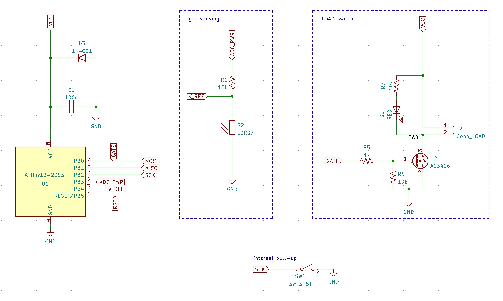
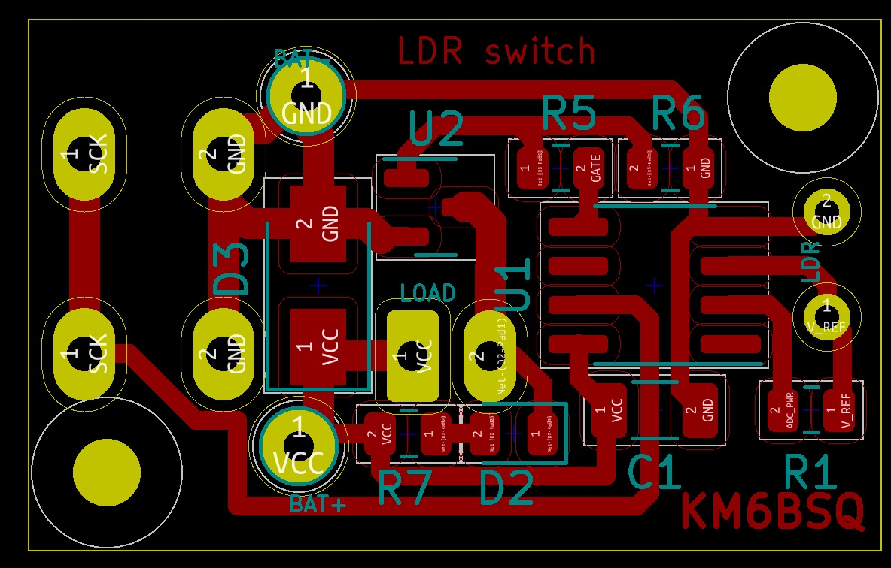
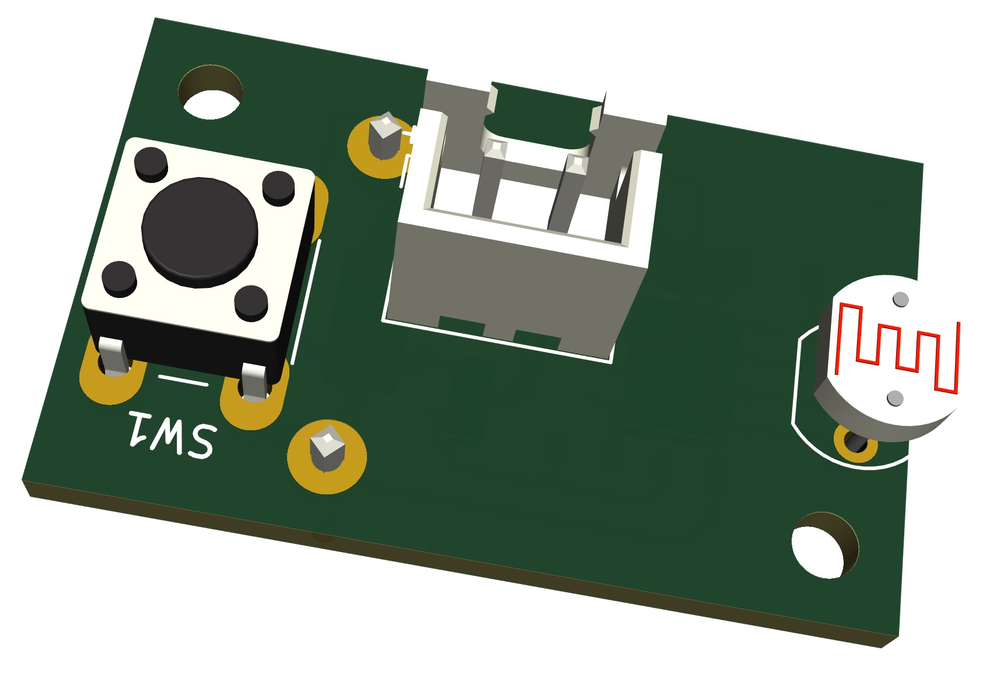
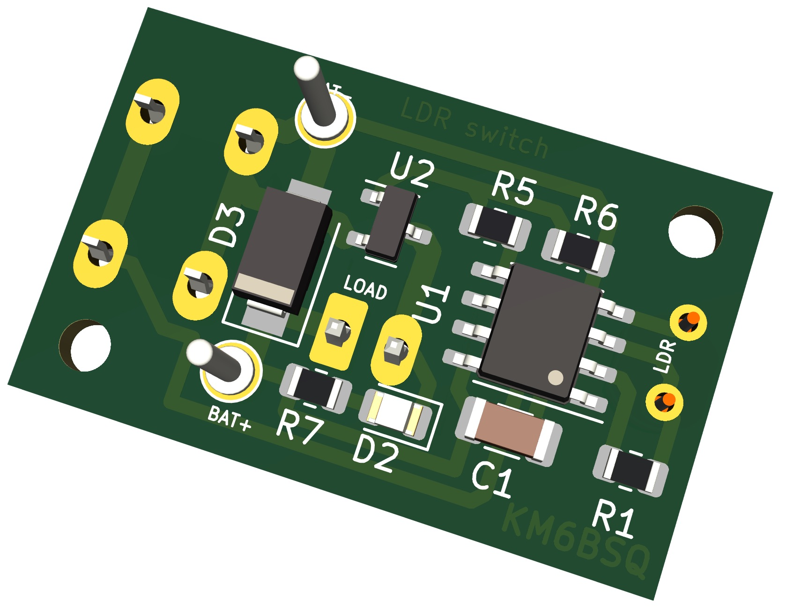

# Tiny LDR switch

Based on $0.60 Attiny13 MCU. 1kB flash, 256B ram.

It turns ON when it's dark (user configurable), stays ON for X hours, turns OFF, and waits till it's dark again. Intended to use with a battery, so it only consumes 5uA. Watch out for input power voltage. Min is 1.8V max is 5.5V. Max load current ~2A. Exceeds this and PCB traces will heat up and unsolder components.
There is simple diode craw-bar reverse voltage protection for MCU.

# Manufacturing

[PCB](./kicad/main.step)

[Enclosure lid](lid.stl)

[Enclosure base](base.stl)

# Code

MCU sleeps all the time. Wakes up via watchdog interrupt every 4 sec to measure light. It powers the LDR/R voltage divider via the MCU pin, takes ADC measurements, and turns off the pin to save power. Compares measured light with the thresholds and goes into ON, OFF, or WAIT_FOR_RESET state. Depending on the state, it turns the load ON/OFF.
A short button press wakes it from sleep, forcing it to measure light. 

* If it was in the OFF state - record the new "dark" light threshold, turn the load ON, start the auto-turn-off timer, and go into the ON state.
* If it was in the ON state - it turns the load OFF and goes into the WAIT_FOR_RESET state.

A long button press lets you set the auto-turn-off timer duration. Keep the button pressed and watch the LOAD blink. 1 blink == 1 hour, 2 blinks == 2 hours etc. Release the button once the desired number of hours is indicated. 

When the timer is UP, the load turns OFF, and the MCU transitions into the WAIT_FOR_RESET state.

There are two light thresholds in the code. 

* "dark" - once it's darker than this, MCU turns the load ON and goes into the ON state
* "bright" - once it's brighter than this, MCU goes from  WAIT_FOR_RESET into the OFF state. 

WAIT_FOR_RESET is meant to capture the daytime reset so that the switch is only active once per day for X hours.
